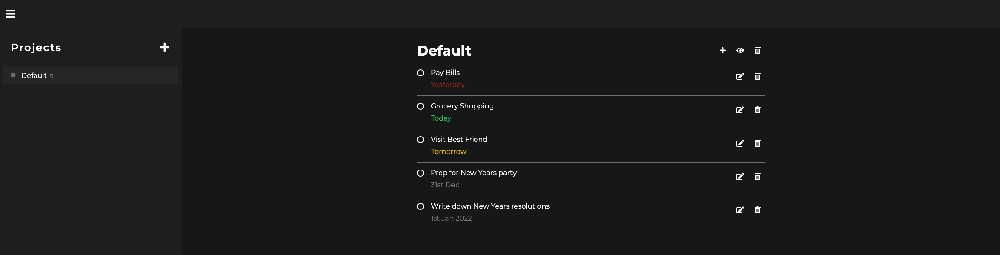

# Todo-list
Todo List app created with HTML, CSS & Javascript for The Odin Project.

## Demo
Here is a working live demo: https://kapaha.github.io/todo-list/

## General info
This project was created as a part of the [Javascript](https://www.theodinproject.com/courses/javascript/lessons/todo-list) course with [The Odin Project](https://theodinproject.com). The aim of this project was to solidate the knowledge I have learnt about OOP principles.

## Features
* Responsive design - works on mobile and tablets
* Creation of projects to store todos
* Creation of todos with a name and due date
* Projects and todos stored in local storage
* Showing / hiding of complete todos
* Dynamic coloring of due date
* Auto sorting of complete todos
* Saving of selected project
* Saving of complete todos visibility preference per project
* Focus trapping of modals

## Built with
* HTML
* CSS
* Javascript
* Webpack

## Status
The project is finished, however I may continue to improve on it as my knowledge of web development improves.
